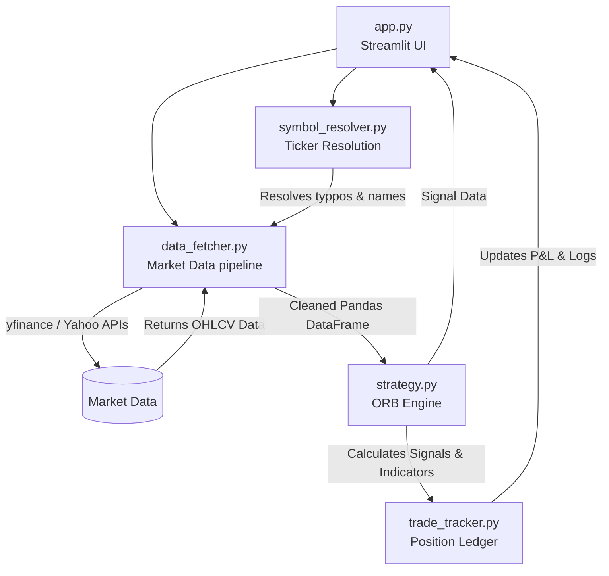
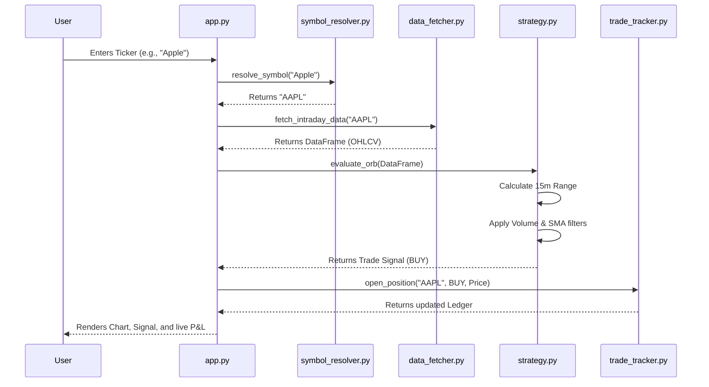

# TRADEX Architecture

TRADEX is a modular, Python-based algorithmic trading simulation dashboard built with Streamlit. Its architecture is explicitly designed around separation of concerns, decoupling data retrieval, trading logic, state management, and user interface components.

---

## 1. High-Level System Architecture

The system operates on a pull-based reactive model powered by Streamlit's event loop. When a user requests data for a stock ticker, the request flows through the resolution, data fetching, and strategy layers before returning actionable signals and visualizations to the UI.

---

## 2. Core Modules Breakdown

### 🖥️ `app.py` (Presentation & Orchestration)

The main entrypoint. It initializes the Streamlit dashboard, manages session state (`st.session_state`), and renders the UI components (hacker-style terminal logs, input fields). It acts as the controller orchestrating calls between the data fetcher and the strategy engine.

### 🌐 `data_fetcher.py` (Data Access Layer)

Handles retrieval of intraday and historical market data.

- Uses `yfinance` to pull OHLCV (Open, High, Low, Close, Volume) data.
- Implements fallback mechanisms and data normalization (ensuring the dataframe is always returned in a consistent format regardless of market conditions).
- Never fails silently; logs connection issues directly to the UI.

### 🧠 `strategy.py` (Business Logic Layer)

The algorithmic brain of TRADEX. It specifically implements a refined **Opening Range Breakout (ORB)** strategy.

- **Inputs**: 15-minute timeframe pandas DataFrames.
- **Logic**: Identifies the high/low of the first 15 minutes of the trading session. Applies moving average trend filters and volume confirmation criteria.
- **Outputs**: Emits `BUY`, `SELL`, or `HOLD` signals with exact trigger prices, stop-losses, and target prices.

### 🔍 `symbol_resolver.py` (Utility Layer)

A robust symbol resolution engine designed to convert human-readable company names or typos into valid broker/API tickers.

- Utilizes exact dictionary lookups, fuzzy string matching, and a Yahoo Finance Search API fallback.
- Ensures the `data_fetcher` never crashes due to a slightly misspelled stock name (e.g., "BRITANIA" -> "BRITANNIA.NS").

### 💼 `trade_tracker.py` & Simulated Execution Engines

Handles state management for simulated trades.

- Tracks entry prices, exit prices, and timestamps.
- Continuously calculates floating P&L (Profit & Loss).
- (Extensible components like `trader.py`, `paper_trader.py`, and `backtester.py` wrap this logic to simulate real-world execution slippage and broker integrations).

---

## 3. Data Flow: Trade Execution Lifecycle

The following sequence diagram illustrates how TRADEX processes a single execution cycle during live market hours:

---

## 4. UI Visualization (Plotly Integration)

TRADEX leverages **Plotly** for interactive frontend charting within `app.py`.
Dataframes returned by `data_fetcher.py` are mapped directly to `go.Candlestick` objects. The outputs of `strategy.py` (such as ORB high/low lines, moving averages, and entry/exit markers) are overlaid onto these Plotly figures to give the user immediate visual confirmation of the algorithmic logic.
